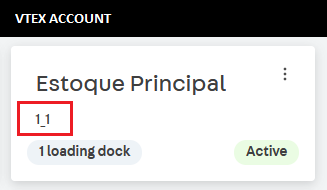

# VTEX InnoShip

This application allows you to integrate multi-carrier shipping using InnoShip API.

## Installation & Configuration

- Use the vtex toolbelt to install.

```bash
vtex install vtex.innoship
```

Open the app settings on your store admin - `https://{{accountName}}.myvtex.com/admin/apps` - click on the InnoShip app and fill in the:
* `InnoShip API TOKEN` (required) - provided by the Innoship platform

You will also need to link your store's warehouses to your innoship account.

1. Go in your VTEX admin `ORDERS > Inventory & shipping > Shipping strategy`, and in the `Warehouses` tab, 
for each active warehouse you must have/create a corresponding location in your innoship account.
2. In you innoship account, go to `Locations & Carriers`, create/edit a location and set the `External Location Id` to
correspond to the VTEX's warehouse `ID`.

 

After configuration, the shipping list can be accessed in your VTEX admin `ORDERS > Shipping List`.

# Features

When generating AWBs, there are a variety of helpful features at your disposal:

### 1. Multiple parcels and weight distribution

Having the order's total weight available and displayed, you have the option to either generate AWBs with only one parcel
covering the entire order's weight thus having only one label for the parcel when printing out the AWB, or you can choose
to have more than one parcel per AWB with the possibility to manually distribute the order's weight across the parcels 
weight fields with an indicator alerting you when the distribution is under or over the total weight limit.

This feature is useful when you need to generate AWBs for orders that needs to be split across multiple packages. 
Generating a single AWB will generate labels for each parcel.


### 2. Option for the receiver to support the shipping charges


### 3. Shipping simulation

Based on selected options, a shipping rate simulation will run, displaying a list of eligible carriers with their respected
shipping rates, from which you can choose a carrier/shipping rate of your desire or leave it on `Automatic`, which will let the 
`innoship` API decide the appropriate carrier, based on the web application's configuration.


### 4. Innoship pickup points

To activate this feature follow these steps:

1. Install the scheduler by making a `POST` request to the following endpoint
> https://{{accountName}}.myvtex.com/api/scheduler/master/innoship?version=4

with the following body:

```json
{    
    "id": "sync-innoship-pickup-points",
    "scheduler": {
        "expression": "*/30 * * * *" 
    },
    "request": {
        "uri": "http://{{accountName}}.myvtex.com/no-cache/sync-pickup-points",
        "method": "POST" 
    }
}
```

This will synchronize all available pickup points from innoship into vtex.<br>
The pickup points will be available under `ORDERS > Inventory & shipping > Pickup points`.

2. You will also need to add a valid Google Maps API Key under `ORDERS > Inventory & shipping > Geolocation shipping`
and `STORE SETUP > Checkout > {click settings cog} > {click checkout tab} > {Google Maps API Key field}`.


3. Then you must create a shipping policy under `ORDERS > Inventory & shipping > Shipping strategy`, check the `Link pickup points` section
and under `Pickup points tags` select the `innoship pickup` tag.
   

4. Configure the shipping rate for the new shipping policy under `ORDERS > Inventory & shipping > Shipping rates`.


### 5. Periodic Innoship AWB updates

Turn on the `AWB AUTO-UPDATE` feature in the `Shipping` page.
The update will run every 4 hours.


<hr>

## Possible Errors

* `Value of field ExternalClientLocation is not valid` - represents the warehouse ID declared in VTEX 
  under `ORDERS > Inventory & shipping > Shipping strategy > Warehouses`.<br>
  In the Innoship Web Application, under `Locations & Carriers`, this VTEX warehouses Is must be associated to a 
  location's `External Location Id`.<br>
  Each active warehouse ID declared in VTEX must have a correspondence in the Innoship Web Application's `Locations & Carriers`,
  via the `External Location Id`.

## Exposed endpoints:

[InnoShip DOCS](https://docs.innoship.io/v1.0/innoship/api-documentation)

### POST - /innoship/request-awb

### GET - /innoship/get-label/:courier/:trackingNumber

### POST - /innoship/request-awb-history
